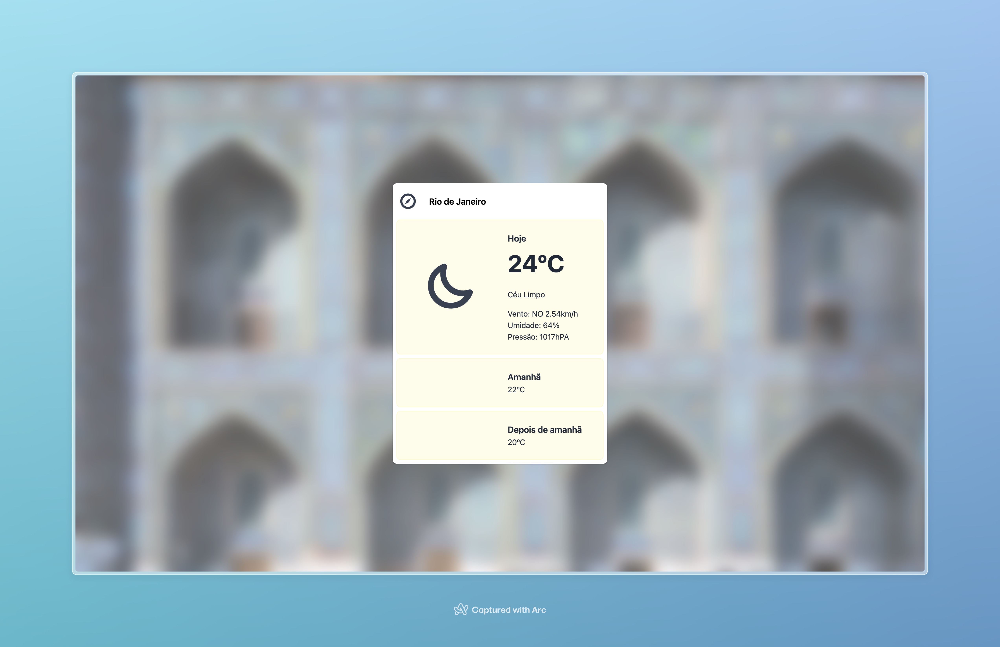

### Projeto NextJS 14 - Desafio de Codificação



## Visão Geral

Este projeto foi desenvolvido utilizando NextJS 14 e React, com o objetivo de criar uma aplicação de previsão do tempo com uma interface mais apelativa e clean. Várias decisões técnicas foram tomadas para otimizar o desempenho, acessibilidade e usabilidade da aplicação.

[Confira o projeto rodando.](https://challenge-charlie-mocha.vercel.app/)

## Decisões Técnicas

- **Visual Apelativo**: O visual foi aprimorado para ser mais atraente e clean.
- **Rotas no Server**: Todos os serviços externos possuem rotas no servidor para consumo pelo frontend, resolvendo problemas de CORS.
- **Imagem do Bing**: Utiliza-se um efeito de vidro (glass effect) para desfocar a imagem do Bing, focando a atenção no widget de previsão do tempo.
- **Utilitários**: Foram criados utilitários para sanitização de input e conversão de temperatura, evitando requisições adicionais.
- **Server-Side Rendering (SSR)**: Imagem e localização de placeholder são obtidas via SSR com componentes de servidor, garantindo que tudo esteja pronto na tela para o usuário.
- **Testes**: Testes foram escritos para cada tipo de arquivo, embora não haja 100% de cobertura para acelerar a entrega.
- **Hooks de Commit e Push**: Utilização do Husky, commit-lint e commitzen para validar linter, rodar testes e build antes de commits ou push, garantindo qualidade e padronização.
- **Validação com Zod**: Variáveis de ambiente são validadas com Zod, notificando o desenvolvedor caso estejam faltando.
- **Boas Práticas de React**: Componentes otimizados, lógica movida para custom hooks e uso de composição.
- **Acessibilidade**: A aplicação foi desenvolvida com foco na acessibilidade.
- **Interface de Monitoramento Genérica**: Foi criada uma interface genérica para ferramentas de monitoramento.

## Melhorias Futuras

- **Testes**: Escrever mais testes e implementar testes e2e com Cypress ou Playwright.
- **Estados de Loading e Erro**: Adicionar estados de carregamento e erro nos componentes.
- **Gerenciamento de Estado**: Utilizar Zustand ou Context API para projetos mais complexos.
- **UI**: Adotar Shadcn para criação da interface em vez de desenvolver manualmente.
- **Desempenho**: Revisar componentes para identificar gargalos de renderização.
- **Monitoramento**: Implementar monitoramento no middleware do Next e em outros pontos.
- **Caching**: Melhorar o caching das requisições.

## Rodando o Projeto

### Pré-requisitos

- Node.js
- Docker
- docker-compose

### Configuração

1. Clone o repositório:

   ```bash
   git clone https://github.com/seu-usuario/seu-repositorio.git
   cd seu-repositorio
   ```

2. Crie o arquivo `.env` utilizando o `.env.example` como modelo e preencha as variáveis necessárias. Entre em contato para obter os valores específicos, se necessário.

### Usando Docker

#### Desenvolvimento

Para rodar o ambiente de desenvolvimento com Docker, utilize o comando:

```bash
docker-compose -f docker-compose.dev.yml up --build
```

#### Produção

Para rodar o ambiente de produção com Docker, utilize o comando:

```bash
docker-compose up --build
```

### Usando NPM

1. Instale as dependências:

   ```bash
   npm install
   ```

2. Inicie o servidor de desenvolvimento:
   ```bash
   npm run dev
   ```

## Estrutura do Projeto

A estrutura do projeto é organizada da seguinte forma:

```
/src
  /app           # Rotas da API e app
  /components    # Componentes React
  /utils         # Utilitários
  /hooks         # Custom Hooks
  /assets        # Fontes
  /services      # Serviços de API
```

## Contribuindo

Para contribuir com este projeto, siga os passos abaixo:

1. Faça as suas modificações
2. Adicione suas modificações ao stage do git (`git add .`).
3. Commit suas alterações com o commit-lint (`npm run commit`).
4. Push para a branch (`git push origin feature/nova-feature`).
